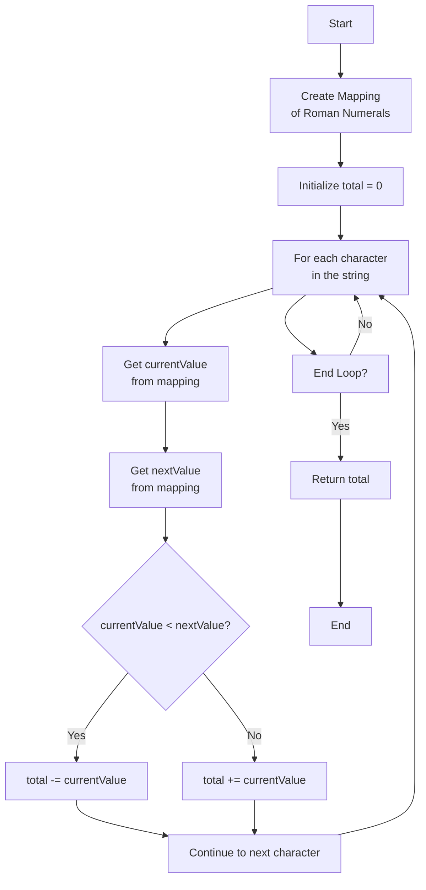

## Simplified Greedy

## Example Calculation

For the Roman numeral **MCMXCIV**:

1. M > C → +M
2. C < M → -C
3. M > X → +M
4. X < C → -X
5. C > I → +C
6. I < V → -I
7. V > 0 → +V

Calculation:  
M + (M - C) + (C - X) + (V - I) = 1000 + (1000 - 100) + (100 - 10) + (5 - 1) = 1994
