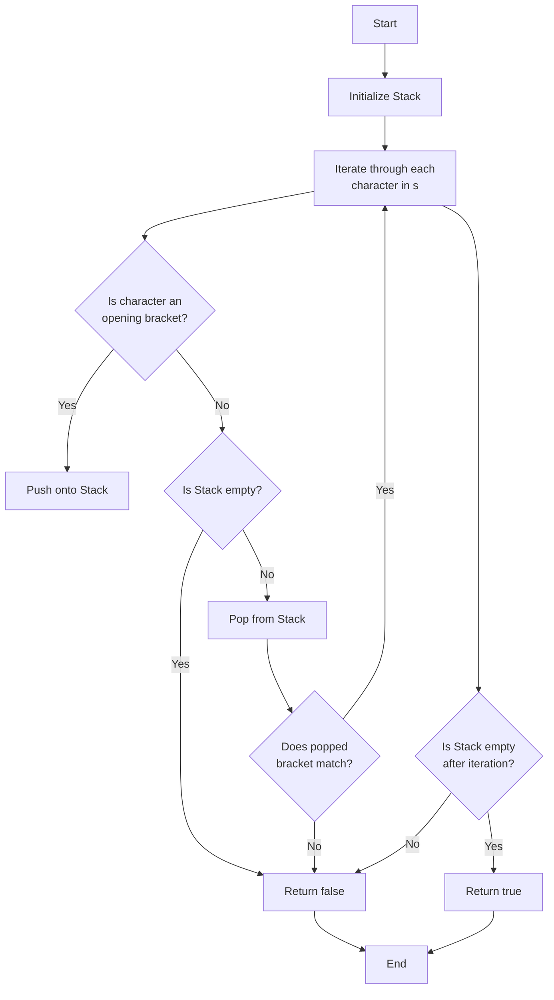

```mermaid
flowchart TD
A[Start] --> B[Initialize Stack]
B --> C[Iterate through each 
character in s]
C --> D{Is character an 
opening bracket?}
D -- Yes --> E[Push onto Stack]
D -- No --> F{Is Stack empty?}
F -- Yes --> G[Return false]
F -- No --> H[Pop from Stack]
H --> I{Does popped 
bracket match?}
I -- No --> G
I -- Yes --> C
C --> J{Is Stack empty 
after iteration?}
J -- Yes --> K[Return true]
J -- No --> G
G --> L[End]
K --> L
```
